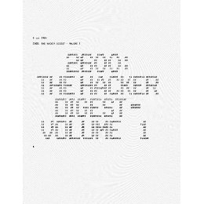

# 101 - Basics of Hacking

<a rel="license" href="http://creativecommons.org/licenses/by-sa/3.0/deed.en_GB"></a><br /><span xmlns:dct="http://purl.org/dc/terms/" property="dct:title">Hacking</span> by <a xmlns:cc="http://creativecommons.org/ns#" href="https://iam.tj/projects/hacking" property="cc:attributionName" rel="cc:attributionURL">TJ</a> is licensed under a <a rel="license" href="http://creativecommons.org/licenses/by-sa/3.0/deed.en_GB">Creative Commons Attribution-ShareAlike 3.0 Unported License</a>.<br />Permissions beyond the scope of this license may be available at <a xmlns:cc="http://creativecommons.org/ns#" href="https://iam.tj/projects/licensing/" rel="cc:morePermissions">https://iam.tj/projects/licensing/</a>.

[TOC]

## Overview

## The Hacker Ethic (what is a Hacker) ?

In 1997 **Eric S. Raymond** published an essay on software engineering methods entitled "**The Cathedral and the Bazaar: Musings on Linux and Open Source by an Accidental Revolutionary**" which became the most influential observation and critique on software development. Later he included a Frequently Asked Questions answered (FAQ) titled "**How to Become a Hacker**" [1] that describes the attitude, skills and cultural of hacking:

Note: If this frame is blank and you see a shield  in the browser address bar you must click on the shield and disable protection to allow mixed content in order to view Eric Raymond's FAQ.
> <iframe width="80%" height="500pt" src="http://www.catb.org/~esr/faqs/hacker-howto.html#what_is" allowfullscreen></iframe>


A summary which I cannot improve upon comes from Wikipedia [2]

>A hacker is someone who loves to program or who enjoys playful cleverness, or a combination of the two. [3] The act of engaging in activities (such as programming or other media [4]) in a spirit of playfulness and exploration is termed hacking. However the defining characteristic of a hacker is not the activities performed themselves (e.g. programming), but the manner in which it is done: Hacking entails some form of excellence, for example exploring the limits of what is possible, [5] thereby doing something exciting and meaningful.

Richard Stallman, the founder of the *Free Software* movement explains about hackers who program:

>What they had in common was mainly love of excellence and programming. They wanted to make their programs that they used be as good as they could. They also wanted to make them do neat things. They wanted to be able to do something in a more exciting way than anyone believed possible and show "Look how wonderful this is. I bet you didn't believe this could be done." [6]

## What a Hacker Is NOT!

Wikipedia continues:

>Hackers from this subculture tend to emphatically differentiate themselves from what they pejoratively call "crackers"; those who are generally referred to by media and members of the general public using the term "hacker", and whose primary focus — be it to malign or benevolent purposes — lies in exploiting weaknesses in computer security. [7]

## Hackers - Wizards of the Electronic Age

The hacker community began life - as many technology cultures did - in the United States of America; mainly in California and Massachusetts. By the 1980s it was a sub-culture being recognised outside of the technology world. In 1984 Fabrice Florin produced a documentary for Public Broadcasting Service (PBS - the USA's poor cousin of the BBC) at the first *Hackers Conference* in California. This was a decade before the Internet became a common public communications system.

Many of the unknowns attending the conference have since become some of the most well-known and influential personalities of the information technology revolution. So, with apologies for the over-abundance of beards, please meet the unsung heroes of the computer revolution.

> ### Watch the Video
<iframe width="420" height="315" src="//www.youtube.com/embed/bl_1OybdteY?rel=0" frameborder="0" allowfullscreen></iframe>

> ```"Hackers - Wizards of the Electronic Age" - Fabrice Florin, 1984```

Also in 1984 Eric Corley, under the pen-name Emmanuel Goldstein, began publishing "2600" in the USA, a magazine for hackers of all shades. Now known as "[2600: The Hacker Quarterly](http://www.2600.com/)" and available globally online, the magazine catered to the growing community of hackers.

In those days - before the public Internet - communication was done using telephone modems dialling into bulletin board services (BBS) where users could send and receive messages to other users of that BBS much like today's internal company email. Many BBSes allowed upload and download of files for sharing. Calls to BBSs were charged per-minute by the telephone company so the low transmission rates and poor connection quality could lead to large telephone bills especially if the BBS wasn't local or even in the same country.

Networks of BBSs developed the largest of which was [FidoNET](http://en.wikipedia.org/wiki/FidoNet). Created by two hackers, Tom Jennings in San Francisco and John Madil in Baltimore, it allowed a subscriber to dial into a local BBS and exchange messages with subscribers of other BBSs around the world. The services were all text - including the Fido dog logo:
```
                  __
                  /  \
                 /|oo \
                (_|  /_)
                 _`@/_ \    _
                |     | \   \\
                | (*) |  \   )) 
   ______       |__U__| /  \//
  / FIDO \       _//|| _\   /
 (________)     (_/(_|(____/
(c) John Madil
```
In educational establishments the demand for sharing information and research drove the development and transformation of the USA's ARPANET into the public Internet that we take for granted today. Growing demand required more, better, and faster software to operate and manage the increasingly sophisticated networks of computer systems as they developed.

At this time most computer systems came complete with not just the binary executable code but the full source-code as well. Access to the source code and build tools allowed software hackers to fix faults (bugs) and add new features to the software programs themselves. There was a culture of sharing and source-code was passed around.

At the Massachusetts Institute of Technologies Artificial Intelligence Media Lab, **Richard Stallman** was single-mindedly expressing his belief that "Software should be free" - "free" as in Freedom. Freedom for users to read, modify, and distribute the software they used without restriction. This was a reaction to the increasing trend of computer manufacturers to impose restrictive copyright licenses which prohibited copying and redistribution whilst no-longer providing the source code.

In 1983 he began the GNU operating system project and in 1985 founded the **Free Software Foundation (FSF)**. In 1989 the FSF published the first **GNU General Public License (GPL)** which was designed to protect user's rights using Copyright law.

## Required Reading and Viewing


 1. "FAQ: How to Become a Hacker", Eric S. Raymond, 2001, [HTML](http://www.catb.org/~esr/faqs/hacker-howto.html) 
 2. "Hackers - Wizards of the Electronic Age", Fabrice Florin, 1984 [Publisher](http://www.handtap.com/hackers/). [DVD ASIN: B0009RS0EM](http://www.amazon.com/exec/obidos/tg/detail/-/B0009RS0EM/ref=hackersvideo/). [Video YouTube](https://www.youtube.com/watch?v=bl_1OybdteY).
 3. "From Counterculture to Cyberculture: Stewart Brand, the Whole Earth Network and the Rise of Digital Utopianism", Fred Turner, 2006, University of Chicago Press, 360 pages, [Hardback ISBN: 0226817415](http://www.amazon.co.uk/gp/product/0226817415?ie=UTF8&creativeASIN=0226817415&linkCode=xm2&tag=iam_tj-21). [Paperback ISBN: 0226817423](http://www.amazon.co.uk/gp/product/0226817423?ie=UTF8&creativeASIN=0226817423&linkCode=xm2&tag=iam_tj-21). [Kindle Edition ASIN: B004BKJVYG](http://www.amazon.co.uk/From-Counterculture-Cyberculture-Utopianism-ebook/dp/B004BKJVYG/ref=dp_kinw_strp_1&linkCode=xm2&tag=iam_tj-21).
 4. "The Cathedral & the Bazaar", Eric S. Raymond, 1999, [HTML](http://www.catb.org/esr/writings/homesteading/)
 5. "FAQ Collection: Hacker History And Culture", Eric S. Raymond, [HTMl](http://www.catb.org/esr/faqs/)

## References


[2]: http://en.wikipedia.org/wiki/Hacker_%28programmer_subculture%29 "Hacker (programmer subculture)"
[3]: http://www.gnu.org/gnu/thegnuproject.html "The GNU Project"
[4]: http://www.gnu.org/philosophy/rms-hack.html "The Hacker Community and Ethics: An Interview with Richard M. Stallman, 2002"
[5]: http://stallman.org/articles/on-hacking.html "On Hacking - Richard Stallman"
[6]: http://www.handtap.com/hackers/  "Hackers - Wizards of the Electronic Age. Video/TV/DVD. 1985"
[7]: http://catb.org/~esr/faqs/hacker-howto.html "Eric Raymond - How to Become a Hacker"